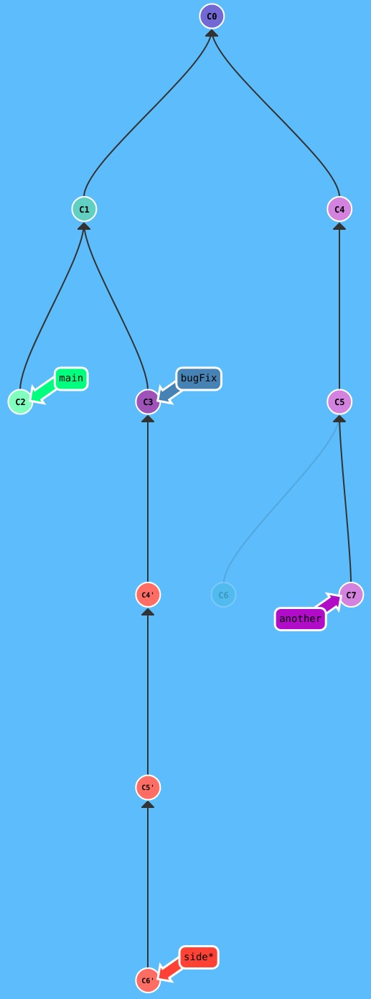
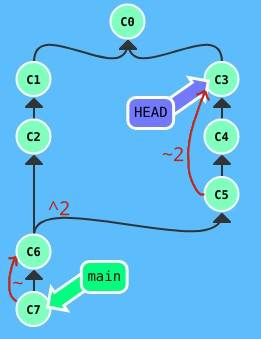

Git is a version control system.
This means that it tracks how the contents of a set of files in a directory tree is changed over time.
It is not a continuous tracking of every change make to the files, instead we make explicit named snapshots.
The creation of such a snapshot is called to make a commit.
The directory tree with files is called a working copy.
The files Git needs to work, often stored in a directory  named `.git` is called a repository.

Git is optimized for text files with line semantics.
By "line semantics" I mean that each line is its own thing and we don't do line rewrapping/reflow like one would do when editing a long paragraph of natural language text.
Git has its origin in software development and is mostly used to store source code.

The core of the Git version control system is the `git` executable.
`git` is a CLI tool, meaning that we type `git` commands in a terminal.
There are also may GUI Git tools, many of which invoke the `git` executable to perform actions.
`git` is typically invoked as `git COMMAND` where `COMMAND` is some Git command that performs some action.
This note describes many such Git commands.

# Repository / Working Copy

A repository is a directory where the files and directories that Git needs, including the history of the files tracked by the repository, are stored.
A working copy is a directory that holds the files being tracked by a Git repository, possibly with the content from an earlier commit and/or with local changes.
A working copy always holds its repository in a `.git` directory in the root of the working copy.

To create a new empty repository, also called a bare repository, that working copies can be created from but that cannot itself be used as a working copy:
```shell
git init --bare .
```
This will create the internal Git file system structure directly in the current directory.
Can only be done in an empty directory.

We can also create a combined repository / working copy from a possibly non-empty directory:
```shell
git init .
```
This will create the internal Git file system structure in a subdirectory named `.git`.
Files and directories that already exists in the current working directory will not be modified and can be tracked by adding them to a commit.

Both ways to initialize a repository support giving a custom name to the initial branch:
```shell
git init [--bare] --initial-branch=main .
```

To create a working copy from a previously created repository:
```shell
git clone URL [DIRECTORY]
```

`URL` can be a file system path on the same machine.
For more on this see _Remotes_.
The optional path is the directory where we want the working copy to be created.
If we don't specify a path then a directory named after the repository will be created in the current working directory.
The target directory must be empty.


## Repository / Working Copy Commands

```shell
# Create a new repository + working copy of the current working directory.
git init .

# Create a new bare repository in the current working directory.
git int --bare .

# Create a new working copy from a previously created repository.
git clone URL [PATH]
```


# Commits

A commit records the changes that was made to the tracked files since the previous commit.
Such a change is sometimes called a delta.
The sequence of all commits from the one where the file(s) was added to the current one describes the history of the file and when the changes described by those commits are applied one after the other we will arrive at the current version of the file.

The previous commit is called the current commit's parent.
The chain of parents going back to the first commit is called the current commit's ancestors.
The first commit in a Git repository is often called the initial commit.
The commit we are currently on is called `HEAD`.
The commits form a directed asyclic graph rooted at the initial commit.
The graph may have multiple leaf commits where each such commit typically represent the head of some development effort.
`HEAD`, the current commit, is often one of the leaf commits.
The contents of the files in the working copy reflects the state represented by the `HEAD` commit and all its ancestors, plus any local changes we may have made on top of that state.

A commit stores a bunch of information:
- Which files are being changed by the commit.
- What changes are made to each of the changed files.
- Which commit the changes builds upon, called the parent commit.
	- A commit can have multiple parents, see _Merging_.
- The author of the change.
- The date and time the commit was made.
- A hash that identifies the commit.
	- The parent commit is stored as the parent commit's hash.

A commit is created with:
```shell
git commit
```
This form will open a text editor where a commit message is be written.

To supply the commit message directly use the `-m` flag:
```shell
git commit -m"MESSAGE"
```

A working copy is always on a particular commit, the current commit.
This commit is called `HEAD` because it is the head of the history, the sequence of commits, that leads to the current state of the working copy.


## Commit Commands

```shell
# Create a new commit. Opens a text editor for the commit message.
git commit

# Create a new commit with the given commit message.
git commit -m"MESSAGE"
```


# Branch

A branch is a way to name sequences of commits.
A branch is a named pointer to a specific commit.
All ancestors if that commit are also considered part of that branch.
Branches are used to logically divide up work.
A working copy is always on a specific branch, unless the working copy is in a detach head state.
You can see which branch the working copy is on with
```shell
git branch --show-current
```
The branch pointer is updated to the new commit when we make a new commit while being on that branch.
Multiple branches can point to the same commit.
When a commit is made only the current branch is advanced to the new commit.
Other branches on the parent commit remain on the parent commit.
List the local branches with
```shell
git branch
```
The current branch is marked with a `*`.
This means that `HEAD` points to the same commit as that branch.
When we make a new commit in in this state both `HEAD` and the current branch is updated to point to that new commit.

To also list branches on remotes use the `--all` flag:
```shell
git branch --all
```

A repository starts of with a single default branch,  often named `main` or `master`.

## Creating A  New Branch

A new branch is created with one of:
```shell
git branch BRANCH_NAME

git checkout -b BRANCH_NAME

git switch -c BRANCH_NAME
```
All three forms will create a new branch that points to the current commit, that is, `HEAD` is unchanged.
With the first form, `git branch`, the new branch  will be created "in the background", i.e. it will not be made the current branch.
The second form, `git switch -c`, is new, and experimental with Git 2.23, and is a way to manage branch switching that will replace `git checkout` for that purpose.
The third form, `git checkout -b`, both creates the new branch and checks it out, i.e. makes it current.
`git checkout` has multiple different use-cases and `git switch` was introduced as a safer option to `git checkout` so that one doesn't accidentally perform one of `git checkout`'s other functions when a branch switch is intended.

We can also create a new branch initially pointing to any commit in the repository:
```shell
git branch BRANCH_NAME COMMIT
```

## Moving A Branch

A branch can be moved, meaning that we can make a branch point to a different commit.
```shell
git branch -f BRANCH COMMIT
```

As an example, consider a case where we commit something bad to a branch named `feature/some-feature` and we want to take a step back.
```shell
git branch -f feature/some-feature feature/some-feature^
```

The `-f` (force) bit is required because normally `git branch` is used to create new branches, not modify existing branches.

`git branch` cannot be used to move the current branch.
For this you need `git reset`.


## Branch Commands

```shell
# List local branches.
git branch

# List local and remote branches.
git branch --all

# Show the name of the current branch.
git branch --show-current

# Create a new branch in the background.
git branch BRANCH_NAME

# Create a new branch and switch to it.
git switch -c BRANCH_NAME  # New way.
git checkout -b BRANCH_NAME  # Old way.

# Create a new branch in the background pointing to a specific commit.
git branch BRANCH_NAME COMMIT
```

# Merge

A merge can be seen as the inverse of making a branch.
A branch produces a situation where two (or more) separate commits have the same parent, a diverging fork.
A merge is a commit that has two (or more) parents, a converging fork, a joining.
Remember that a commit describes the state of the repository that is created by applying all the commit's ancestor commits from the initial commit up until the current commit.
By having two parent commits a merge commit combines to parallel sequences of commits together.
The merge commit says "I want to include all the work from this parent over here and this one over here.".
If there are conflicting changes in the parallel commit paths that the creation of the merge will have a merge conflict that must be resolved before the merge commit can be created.
So a marge commit describe not only which branches are being merged but also the additional changes necessary to resolve any merge conflicts.

The workflow is:
- Create and switch to branch.
- Make changes and commits.
- Merge.

Just like regular commits, a merge commit is made on a particular branch.
If we are on `main` and merge another branch then the commits in that branch's  history is merged into `main`.
The other branch is left unchanged.
If we are on the other branch and merge `main` the changes made on `main` since the other branch was created or last merged is brought into that other branch.


## Fast-Forward Merge

There are two kinds of merges.
The one described above is the kind that creates a merge commit.
A merge commit is required when there are commits in both of the merged branches.
The other type of commit happens when there are new commits on the branch we are merging in but not on the current branch.
In this case the branch we are merging in represents a set of pure additions to the current branch.
There has never been any actual forking, the branch simply moved forward while the current branch was standing still.
In this case Git can "fast-forward" the current branch to the merged branch's commit.
By default `git merge` will do a fast-forward if possible and create a merge commit if required.
If we want to force the creation of a merge commit even when a fast-forward would have been possible then we can give the `--no-ff` flag:
```shell
# Merge and force the creation ofa merge commit.
git merge --no-ff
```

In some cases we may expect to be able to do a fast-forward but want to make sure that no merge commit is created unexpectedly. 
By passing `--ff-only` we tell Git to abort the merge, i.e. do nothing, if a merge would have otherwise been created.
```shell
# Only allow fast-forward merge, abort if a merge commit would have been required.
git merge --ff-only
```

Fast-forward is possible when the current branch is an ancestor of the branch being merged.
In this case the merged branch has seen everything in the current branch.
No conflicts are possible in this case since by definition there is nothing to conflict with.
The current branch has not changed since the merged branch was created.


## Merge Commands

```shell
# Bring changes from another branch into the current one.
git merge OTHER_BRANCH

# Create a merge commit even if a fast-forward would have been possible.
git merge --no-ff OTHER_BRANCH

# Only merge if a fast-forward is possible, abort otherwise.
git merge --ff-only OTHER_BRANCH
```


# Rebase

Rebase is typically used when bringing changes in `main` back to a development branch so that the branch is kept up-to-date with other work that has been done and merged to `main`.
Rebase is an alternative to merge when bringing changes in one branch into another.
A merge takes two parallel series of commits and creates a new commit that has both of them as parents.
That is, a merge merges two parallel paths into a single path.
Rebase, on the other hand, makes it appear as-if all the work on the branch had been done on top of the current commit in `main` instead of the commit from which the branch was actually created.
The file changes recorded in the commits on the branch are applied not to the original `main` commit but instead to the current `main` commit.
The result of this is a set of new commits on the branch, and the old commits are discarded.
In essence, a rebase takes the commits from their current place in the commit history and plots them down somewhere else.
The places are the "bases" that the rebase name hints at.
The branch was created from a particular base commit but now we want to move it to a new base.

If the file changes recorded in the branch's commits are not compatible with the the contents of the working copy state of the new base commit then there is a merge conflict that must be resolved.
The result of the merge conflict resolution is changes to the commits being moved so that they become compatible with the new base.
So a rebase does not just move the branch from one base commit to another, it also changes the moved commits.
Even if no changes are necessary to the file content changes stored with the moved commit the commits themselves are still changed since the parent of the first commit in the branch is changed.
Since the parent commit is an integral part of a commit changing the base parent of the branch changes the hash of the first commit on the branch.
Since the hash of the first commit changed the parent of the second commit must change to that new hash.
Since the second commit had its parent changed this changes the hash of the second commit as well so we must also update the third commit and so on for all commits.
So after a rebase ALL commits on the branch are brand new commits and the old commits are gone.

One of the advantages of rebasing over merging is that is produces a nicer looking history.
Instead of the history branching and merging in a way that reflects the realities of software development and how the work was actually performed we throw all of that information away an instead present a neatly packaged lie.

## Multiple Rebases

Git seems  to track commits as they move between locations.
Here is a screenshot from https://learngitbranching.js.org/ the _Rebasing over 9000 times_ level.


_Image provided by [learngitbranching.js.org](https://learngitbranching.js.org/)._

Here we have already rebased `side` from the old `C6` onto `bugFix`, which created `C4'`, `C5'`, and `C6'`.
The goal is to rebase `another` onto `side` so that we get a fully linear history from `C0` to a newly created `C7'`.
My worry was that, since `C4` is separate from `C4'` and `C5` if separate from `C5'`, Git would not realize that the rebase we just did already copied those commits and thus the rebase of `another` onto `side` would copy those commits again.
Luckily, this is not what happens.
Git knows the provenance of the `C#'` commits and realizes that the only commit in the `another` ancestry chain that needs to be copied is `C7`.
So we get a single `C7'` after `C6'` and all is well.
TODO How does this tracking work?


## Rebase With Two Arguments

By default rebase will rebase the current branch on top of the branch we pass as an argument.
If we instead pass two branch arguments Git will rebase the second branch on top of the first branch.

```shell
git rebase NEW_BASE BRANCH_TO_MOVE
```


# Interactive Rebase

During an interactive rebase the user can control the way the commits are applied.
The control interface is a text file that is initialized by Git to contain a list of the relevant commits with their hashes and messages.
Each line also contains a word that describe what should be done with the commit:
- Keep: The commit is applied.
- Drop: The commit is not applied.
- Squash: The change contained  in the commit is included but not as a separate commit but instead inserted into one of the neighboring commits.
	- Which one, above or below?
By editing the file we can perform the following actions:
- Keep the commit: Leave 
- Reorder commits: By reordering the lines in the file.
- Drop commits: By 

Pass the `-i` flag to start an interactive rebase.
```shell
git rebase -i COMMIT
```
The operation performed here is to take all commits in the range from the first common ancestor of `HEAD` and `COMMIT` to the current commit and apply them on top of `COMMIT`.


# Reset

Moves the current branch backwards along the parent references.
It's like rewinding time for that branch and resetting it back to an earlier state.

To move non-current branches one can use `git branch -f BRANCH TARGET_COMMIT` instead.

To move the current branch backwards one commit relative to `HEAD`:
```shell
git reset HEAD~1
```

A reset will not only move the current branch to another commit, it will also update the working copy to the state of that commit.

Resetting a branch rewrites history.
This can cause issues if done with branches that exists not only on our own machine.


# Revert

Create a new commit that does the opposite of another commit.
This effectively undos the changes done by that other commit.
Behaves just like a regular commit so there are no issues with using  this with shared branches.
The other commit remains in the history but the changes it made are hidden by the changes in the created commit.

```shell
git revert HEAD~1
```


# Cherry-Pick

A cherry-pick creates a copy of some commit and applies to to your current branch.
It acts as-if a user had looked at the diff for the commit and hand-applied it to the working copy and the comiitted.

```shell
git cherry-pick COMMIT [COMMIT..]
```

Cherry-pick only picks exactly the commits you listed and not the entire history as a merge would.

A commit that is an ancestor of `HEAD` cannot be cherry-picked.
(
Why not?
TODO Try it and see what happens.
)

# Tags

A tag is used to give a particular commit, a point in history, a name.
Such names  are often used for releases.
So we can have a `1.0` tag and a `1.1` tag and so on.

Tags are similar to branches but instead of being updated when new commits are added, a tag is never moved.
The only way to "move" a tag to a new commit is to delete it and create a new tag with the same name pointing to another commit.

A tag is created with:
```shell
git tag NAME [COMMIT]
```
This creates a tag named `NAME` that points to the commit `COMMIT`.
If `COMMIT` is not specified then `HEAD` is used.

Since a tag cannot be updated by committing, checking out a tag will make the working copy enter a  detached `HEAD` state.


## Describe

Describe is used to find where we are in the repository relative to a tag.
That is, it describes where `HEAD`, or some other commit, is relative to the closest tag.

```shell
git describe [REF]
```

The output of `git describe` has the following form:
```
TAG-NUM_COMMITS-gHASH
```
where
- `TAG` is the closest ancestor tag in history.
- `NUM_COMMITS`: The number of commits that separate the tag and and `REF`.
	- If `NUM_COMMITS` is 1 then the  tag is the parent of `REF`.
- `HASH`: The commit has of `REF`.

I have no idea what the `g` means.
TODO Figure out what the `g` means.

There is a surprising corner case when the commit identified by `REF` is a target of a tag.
One might thing that we would get `NUM_COMMITS` be 0 and `HASH` the has of the commit in question, but this is not what happens.
Instead those parts of the output, and  the separating dashes are removed, breaking parsers everywhere.


# Identifying Commits

Each commit has a hash and can be identified by that hash.
The hashes should all be unique, if two commits have the same hash, a hash collision, then Git will be having trouble.
Since they must be unique the hashes are quite long, to reduce the likelihood of hash collisions.
Here is an example hash: `fed2da64c0efc5293610bdd892f82a58e8cbc5d8`.
When identifying a commit using a hash we don't need to type out the entire hash.
It is enough to type out enough characters to uniquely identify a single commit that exists within the repository.

We can also use branches to identify commits.
Each branch points to a commit and naming that branch also names the commit the branch points to.

We can also identify commits based on their location relative to some other commit.
This is called a relative ref.
We can base a relative ref from a commit hash, a branch, a tag, or `HEAD`.

There are multiple ways to create a relative ref, here using `HEAD` as the base:
- `HEAD^` (caret operator): Move to the parent.
	- If there are multiple parents then I assume the first  parent is used.
		- TODO Verify the above.
	- Can be given multiple times: `HEAD^^^` means go to the third ancestor.
- `HEAD~#` (tilde operator): Follow `#` parent links where `#` is an integer.
	- If no number is given then it defaults to 1, meaning `~` does the same as `^`: goes to the parent.

## Multiple Parents And `^`

Since a commit may have multiple parents we need a way to  specify which parent to chose.
With `^` this is done by appending a number.
This number is the index of the wanted parent in the parents list in the commit that `^` is applied to.
The order of the parents is dictated by the order of arguments passed to `git merge` when the commit with multiple parents was created.

For example, consider a case where a branch was created by merging a feature branch into `main`:
```shell
# Currently on main.
git merge feature/some-feature
```

The merge commit created from this has two parents.
The first parent is `HEAD` at the time the command is run, i.e. the commit `main` pointed to.
The second parent is the commit that the merged branch, `feature/some-feature` in the example, points to.
If more branches are listed on the `git merge` command line then those are added in order to the parents list.

So in short: `parents` becomes `HEAD`, `MERGED_BRANCH` `[, MERGED_BRANCH...]`


## Combined Operators

We can combine `^` and `~` arbitrarily.
For example, `HEAD~^2~2`means:
- `HEAD~`: Go to the parent.
- `HEAD~^2`: Go to the parent and then the second parent.
- `HEAD~^2~2`: Go to the parent, then the second parent, then the second ancestor.

Given the repository shown in the image below and starting at `main`, the example above will put the working copy at the commit labeled `HEAD`.


_Image provided by [learngitbranching.js.org](https://learngitbranching.js.org/) with annotations added for clarity._


#  Modifying An Ancestor Commit

Sometimes we want to modify the changes contained in an older commit.
There are multiple ways to achieve  this.

## Interactive Rebase / Amend / Interactive Rebase Method

Use an interactive rebase to move the commit we want to change to the end of the history.
```shell
git rebase -i COMMIT_TO_MODIFY^
```
Reorder the commits so that the  commit we want to change is at the top (Or is it bottom?).

Make the wanted changes to the files in the working copy.
Commit with `--amend` to insert the change into the already existing commit.
```shell
git commit --amend
```

Do another interactive rebase to reorder the now modified commit back to its original location.
```shell
git rebase -i NO_IDEA_WHAT_TO_PASS_HERE
```

I don't know how well this method handles conflicts during the rebase steps.

Since this rewrites history it is not safe to with commits that has been pushed.


## Cherry-Pick Method

This method applies only when we want to copy a collection of commits from one branch to another and change one of them in the process.

Start with the receiving branch as the current one.

Cherry-pick all commits up to and including the commit we want to change.
In this example we have two such commits and `COMMIT_2` is the one we want to change.
```shell
git cherry-pick COMMIT_1 COMMIT_2
```

We now have the working copy in the state described  by the commit we want to change.
We can now make the change.
Commit with `--amend` to apply the change to the current commit, i.e. `COMMIT_2`.
```shell
git commit --amend
```

With the fix applied we can cherry-pick the rest of the commits.
In this example we have one such commit, `COMMIT_3`.
```shell
git cherry-pick COMMIT_3
```


# Detached `HEAD`

Normally a working copy is on a particular branch, meaning that the branch in question is current and `HEAD` points to the same commit as that branch.
Or rather, `HEAD` points to the branch, which points to the commit.
If we make a new commit then both `HEAD` and the branch is updated to point to the new commit.
Or rather, the branch is updated and since `HEAD` points to the branch `HEAD` tags along to the new commit.
Our working copy is attached to that branch through `HEAD`.

A working copy does not need to be attached to any branch.
We can chose to attach it to a commit instead.
In this case `HEAD` points directly to a commit instead of to a branch.
This state is called detached `HEAD` since the commit we are currently on, `HEAD`, is not linked to any branch.
There may still be branches that point to the same commit, but making new commits will not update any branch to point to that new commit.

`HEAD` is a symbolic name that refers to the thing we are currently on, which may be a branch or a commit.
When it is a commit then we are in a detach `HEAD` state.

To detach `HEAD` from the current branch and point it directly to a commit, switch to that commit:
```shell
git switch HASH
```


# Remotes

A remote is a copy of the same repository stored somewhere else.
That somewhere else can be another directory on the same machine or another machine.
To work with remotes you need a way to access that remote, you need its  URL.
If the remote is on the same machine then the URL is a regular file system path.
If the remote is on another machine then the URL is often a HTTPs or SSH address, possibly with a user name for authentication.

If a repository already exists on a remote then we  can create a local working copy of that repository with:
```shell
git clone URL [DIRECTORY]
```

If `DIRECTORY` is not specified then a new directory named  after the repository will be created.

`git clone` will create a complete copy of the remote repository including all history.

All remotes are recorded with a name in our local repository.
The repository from which our working copy was created is by default named `origin`.

We can list the remotes with their names and URLs with:
```shell
git remote -v
```

Each remote may be listed twice, once for fetch (read) operations one once for push (write) operations.
A fetch downloads new things that have happened on the remote since we cloned  or last fetched.
A push uploads new things that we have done in our local repository to the remote.

## Remote Branches

The branches that exists on the remote also have a representation in our local  repository.
Their named are prefixed with `remotes/REMOTE_NAME/`.
So if someone else in another working copy created and pushed a branch named `feature/some-feature` to a remote we have named `origin` then that branch will show up in our repository as `remotes/origin/feature/some-feature` after we  do a fetch.
These branches are not listed with a regular `git branch`.
To see them we need to pass the `--all` flag:
```shell
git branch --all
```

These branches reflect  the state of the remote repository.
They are not the actual remote branches, they are just a representation.
We cannot work directly on these branches.

We can check out these branches, but since they aren't local branches then won't behave as regular branches.
They can be considered being read-only from our repository, so checking one out will cause our working copy to enter a detached `HEAD` state, and switching to one will require the `--detach` flag.

Instead we should checkout or switch to the local form of the branch name.
Even though no branch named `feature/some-feature` exists in our repository, if there is such a branch in any of our remotes then checking it out or switching to it will create a local copy of that branch.
In addition, the local copy will be set up to track the remote branch.
Tracked branches means that Git will help manage merging of commits that happen to this branch in both the local repository and the remote.


## Fetch

`git fetch` is used to fetch, i.e. download, commits  and branches from the remotes that we don't yet have in our repository.
It also  updates which commit each remote branch points to, in case that has changed on the remote.

```shell
git fetch
```

`git fetch` makes our local representation of the repository on the remote match the actual contents of the remote repository.

`git fetch` never modifies anything about the local branches.
If you have a local copy of a remote branch then `git fetch` may download new commits on that branch that are ahead of your commit and move the remote branch forward to the leaf of those commits, but `git fetch` will not move  the local branch forward through those commits.
`git fetch` will only update the repository and only the part of the repository that belong to that remote, it will never update any other parts of the repository or the working copy.

To update the local branches to be in sync with the remote branches you would need to merge the remote branch into your local branch:
```bash
# When on feature/some-feature, a branch that also exists on the origin remote.
# Make our local feature/some-feature up-to-date with the same branch on the remote.
# Thay may result in a merge conflict.
git merge origin/feature/some-feature
```


## Pull

A pull is, by definition, a combination of a fetch an a merge of the current branch's remote into the local branch.
```shell
git pull
```

Note that only the current branch is updated.
If there are other branches being collaborated on and your are currently working in, say, `feature/some-feature` but there is also, say, `feature/other-feature` that you worked on before then a `git pull` will only merge commits from the remote into the current `feature/some-feature`.
The local `feature/other-feature` will remain left behind where it was when you last switched away from it.
This means that when you switch to that branch again it will not be up to date with the remote branch.
If you intend to resume work on that branch then you should do a new `git pull` or manually merge the corresponding remote branch before starting you work.


## Push
 
 A push is used to upload your work to the remote, to publish it to other people.
 ```shell
 git push
```

After a `git push` in one repository, all other repositories using the same remote will get those changes when `git fetch` is run in those repositories.


## Remotes Commands

```shell
# Create a new working copy from an already existing repository.
git clone URL [DIRECTORY]

# List remotes.
git remote -v

# List branches including those fetched from a remote.
git branch --all

# Update the local representation of the contents of the remotes.
git fetch

# Do a fetch and then merge the remote branch into the local branch for the current branch.
git pull

# Manually merge a remote branch into the local branch.
git merge origin/feature/some-feature
```

# References

- 1: [_Learn Git Branching_ @ learngitbranching.js.org](https://learngitbranching.js.org/)
- 2: [_Finding what branch a Git commit came from_ @ stackoverflow.com 2010,2018](https://stackoverflow.com/questions/2706797/finding-what-branch-a-git-commit-came-from)