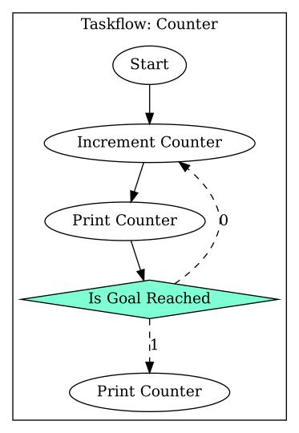

Taskflow is a task graph computing system.
This means that instead of chaining functions together as the program is executed the structure of the program is defined up-front in a task graph that is executed by a runtime.
The following is an example graph from the Taskflow paper [(1)](https://taskflow.github.io/papers/tpds21-taskflow.pdf), we will dive into  what the different symbols mean throughout this note.


The Taskflow C++ library provides an API for defining tasks, task graphs, and a runtime for executing them.
These concepts are codified in three types:
- `tf::Task`: A representation of a piece of work.
- `tf::Taskflow`: A collection of tasks and their dependencies.
- `tf::Executor`: A runtime for executing task graphs.

Taskflow provides a number of different task types with different features and characteristics.
- Static task: Basically just a callback.
- Dynamic task: A task that creates nested / inner child-tasks at runtime.
- Condition task: Runtime selection of which task should be executed next, possibly a prior task.
- Composite task: The inclusion of one `tf::Taskflow` into another.

The type a task has depends on the signature on the callback function associated with the task.
A `void()` function creates a static task.
A `void(tf::Subflow&)` function creates a dynamic task.
An `int()` function creates a condition task.


# A Simple Example

Let's look at the simplest possible example, a task graph that contains a single task that calls a free function.

```cpp
// Taskflow includes.
#include "taskflow/taskflow.hpp"

// Standard library includes.
#include <iostream>

void work() { std::cout << "Doing work.\n"; }

int main()
{
	tf::Executor executor;
	tf::Taskflow taskflow;
	taskflow.emplace(task);
	executor.run(taskflow).wait();
	return 0;
}
```

We can see the central parts of a Taskflow program:
- Some work to perform.
	- In this case the work is to print `Doing work.` and the implementation is a function named `work`.
- An instance of the `tf::Executor` class, here named `executor`.
- An instance of the `tf::Taskflow` class, here named `taskflow`.
- The `work` function being emplaced into the taskflow, creating an internal `tf::Task` instance.
- The executor running the taskflow and waiting for it to complete.

The task graph produced by this code consists, as expected, of a single task:


To generate the the figure the example code was extended with some additional statements to assign names to the Taskflow and the Task and to generate the figure.


# Creating Tasks

A task is any callable, such as a regular function, a lambda expression, or an instance of a type with a call operator, that does not take any arguments.
To create an actual `tf::Task` instance we call the `emplace` member function of the `tf::Taskflow` instance that should  own the task.
This creates a `tf::Task` instance stored inside the `tf::Taskflow`.
The return value of `tf::Taskflow::emplace` is one or more `tf::Task` instances, one for each callable passed.
The `tf::Task` instances can be used to configure the created tasks, for example to add dependencies to other tasks or assign names to the tasks.
When a `tf::Taskflow` is run by an executor then the tasks within that `tf::Taskflow` are executed, meaning that the callables held by the tasks are invoked by the runtime.


# Creating Task Dependencies

Tasks can either precede or succeed other tasks.
A task that precede another task will run to completion before that other task starts.
A task that succeeds another task will not start until that other task has run to completion.
The relationship is symmetric, meaning that if a task A  precedes another task B then task B succeeds task A.
We create these dependencies using member functions on `tf::Task`.

```cpp
// Taskflow includes.
#include "taskflow/taskflow.hpp"

// Standard library includes.
#include <iostream>

void first_work() { std::cout << "First work.\n"; }
void second_work() { std::cout << "Second work.\n"; }

int main()
{
	tf::Executor executor;
	tf::Taskflow taskflow;
	tf::Task first_task = taskflow.emplace(::first_work);
	tf::Task second_task = taskflow.emplace(::second_work);
	first_task.precede(second_task);
	executor.run(taskflow).wait();
	return 0;
}
```

In this case we could achieve the same thing using `second_task.succeed(first_task);` instead.


# Creating Multiple Tasks

We can pass multiple callables to `tf::Taskflow::emplace`.
This causes multiple `tf::Task` objects to be created and returned in a tuple.
C++ structured bindings doesn't allow us to name the type of the elements in the tuple, so we have to use `auto` instead of `tf::Task`.

In the following we create a setup task, a number of parallel tasks, and a teardown task.
Dependencies are set up so that the setup task is run before all parallel tasks and the teardown task is run after all parallel tasks.
Since there is  no dependencies between the parallel tasks they are allowed to  run in parallel.

```cpp
// Taskflow includes.
#include "taskflow/taskflow.hpp"

// Standard library includes.
#include <iostream>

void setup_work() {	std::cout << "Setup work.\n"; }
void parallel_work_1() { std::cout << "Parallel work 1.\n"; }
void parallel_work_2() { std::cout << "Parallel work 2.\n"; }
void parallel_work_3() { std::cout << "Parallel work 3.\n"; }
void teardown_task() { std::cout << "Teardown work.\n"; }

int main()
{
	tf::Executor executor;
	tf::Taskflow taskflow;
	auto [setup, parallel_1, parallel_2, parallel_3, teardown] = taskflow.emplace(
		::setup_work, ::parallel_work_1, ::parallel_work_2, ::parallel_work_3, ::teardown_work);
	setup.precede(parallel_1, parallel_2, parallel_3);
	teardown.succeed(parallel_1, parallel_2, parallel_3);
	executor.run(taskflow).wait();
	return 0;
}
```


# Creating Dynamic Tasks

So far we have been creating static tasks, meaning that we know exactly what is going to be executed when `tf::Executor::run` is called.
Dynamic tasks lets us defer the task creation until runtime, when parts of the task graph has already been executed.
That is, an early task can communicate to a later task and influence the dynamic tasks that are created.

We prepare for dynamic task creation by creating a task from a callable that takes a `tf::Subflow&` as its only parameter.
`tf::Subflow` is similar to `tf::Taskflow` but instead of passing it to a `tf::Executor` for execution it is executed immediately following the task it is associated with.
The dynamic tasks are created much like regular tasks, by passing a callable to the `emplace` member function of `tf::Subflow`.
We say that the task with the `tf::Subflow&` parameter is the parent task and the dynamic tasks, the child tasks, are spawned from the parent task.
The dynamic tasks can have dependencies just like regular static tasks.

The following exemplifies this with a dynamic task that is run as many times as the user requested in the input task.
Notice that no thread synchronization on  the `global_state` variable is needed, Taskflow ensures that there is a synchronization, a happens-before relationship, between tasks with dependencies.
Since the input task precedes the dynamic task we are guaranteed that any side effects of the input task is visible in the dynamic task.

```cpp
// Taskflow includes.
#include "taskflow/taskflow.hpp"

// Standard library includes.
#include <iostream>

// Written in 'input_task', read in 'dynamic_task'.
int global_state {0};

void input_work()
{
	std::cout << "How many dynamic tasks? ";
	std::cin >> global_state;
}

// This task is not scheduled in main, instead it is
// scheduled by create_dynamic_tasks.
void dynamic_work()
{
	std::cout << "Dynamic work.\n";
}

void create_dynamic_tasks(tf::Subflow& subflow)
{
	for (int i = 0; i < global_state; ++i)
	{
		subflow.emplace(dynamic_work);
	}
}

int main()
{
	tf::Executor executor;
	tf::Taskflow taskflow;
	tf::Task input = taskflow.emplace(input_task);
	tf::Task dynamic = taskflow.emplace(create_dynamic_tasks);
	input.precede(dynamic);
	executor.run(taskflow).wait();
	return 0;
}
```

Tasks that succeeds a parent task also succeeds the dynamic tasks spawned by that parent task.


# Conditions And Loops

Tasks need not be performed in a pure top-to-bottom order.
Through conditions we can dynamically decide to only rum some branches of the graph, or run some parts multiple times.
That is, a Taskflow is not a DAG.
There a are some caveats though that we will get to.

Let's start with the basics.


## If-Else

A conditional task is one that chooses and schedules only one if its successors, all other successors are ignored.
Remember that the successors are the tasks that the conditional task precedes.
The selection is made based on the return value if the conditional task, which is an index  into the list of successors.
In the following dependencies setup example we create a situation where if the conditional task returns 0 then the first task is scheduled, if the return value is 1 then the second task is scheduled, and so on for all successors.
```cpp
conditional_task.precede(first_task, second_task, third_task);
```

Let's look at a concrete example, one that reads an integer from standard input and prints a message indicating whether the number is even or odd.
```cpp
// Taskflow includes.
#include <taskflow/taskflow.hpp>

// Standard library includes.
#include <iostream>

static int number {0};

void read_data()
{
	std::cout << "Data? ";
	std::cin >> number;
}

int even_or_odd()
{
	return number % 2;
}

void print_even()
{
	std::cout << "Number " << number << " is even.\n";
}

void print_odd()
{
	std::cout << "Number " << number << " is odd.\n";
}

int main()
{
	tf::Taskflow taskflow;
	tf::Executor executor;

	tf::Task read_data = taskflow.emplace(::read_data);
	tf::Task even_or_odd = taskflow.emplace(::even_or_odd);
	tf::Task print_even = taskflow.emplace(::print_even);
	tf::Task print_odd = taskflow.emplace(::print_odd);

	read_data.precede(even_or_odd);
	even_or_odd.precede(print_even, print_odd);

	executor.run(taskflow).wait();
	return 0;
}
```

The important bits to note in the above example is that the `even_or_odd` function returns an `int` and that the return value is either 0 or 1.
This maps to the two tasks that the `even_or_odd` task precedes: `print_even` and `print_odd`.
If `number` is even then `number % 2` is 0 and if `number` is odd then `number % 2` is 1.
The 0 and 1 return values index into the successor tasks of `even_or_odd`, which are `print_even` at index 0 and `print_odd` at index 1.

The task graph is visualized as follows:


Notice how the the Even Or Odd node is a diamond instead of an ellipse, this indicates that it is a condition task.
Notice how the dependency lines out of the condition task are dashed instead of solid, this indicates that these dependencies are _weak_ dependencies.
Weak dependencies differ from the regular strong dependencies in that they sidestep the regular dependency management and schedule the dependee task immediately regardless of what other dependencies the dependee may have, and a task that has weak dependencies to it may be scheduled as soon as all strong dependencies have been resolved regardless of the state of the weak dependencies.
This set of rules makes it possible to encode loops in the dependency system.


## Loop




# Observations

- Main thread not used as a worker.
	- Can we turn it into a worker?
- Seems difficult to debug.
# References

- 1: [_Taskflow: A Lightweight Parallel and Heterogeneous Task Graph Computing System_ by Tsun-Wei Huang et.al. 2022 @ taskflow.github.io](https://taskflow.github.io/papers/tpds21-taskflow.pdf)
- 2: [_Taskflow QuickStart_ by Dr. Tsung-Wei Huang 2025 @ taskflow.github.io](https://taskflow.github.io/taskflow/index.html)
