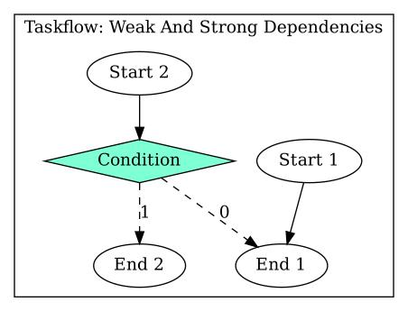
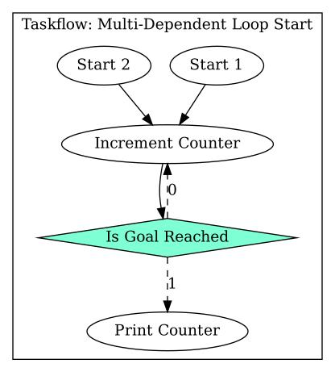
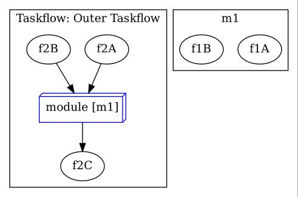

Taskflow is a task graph computing system.
This means that instead of chaining functions together as the program is executed the structure of the program is defined up-front in a task graph that is executed by a runtime.
The motivation is to make it easier to write parallel programs.
The following is an example graph from the Taskflow paper [(1)](https://taskflow.github.io/papers/tpds21-taskflow.pdf), we will dive into  what the different symbols mean throughout this note.


The Taskflow C++ library provides an API for defining tasks, task graphs, and a runtime for executing them.
These concepts are codified in three types:
- `tf::Task`: A representation of a piece of work.
- `tf::Taskflow`: A collection of tasks and their dependencies.
- `tf::Executor`: A runtime for executing task graphs.

Taskflow provides a number of different task types with different features and characteristics.
- Static task: A callback.
- Dynamic task: A task that creates nested / inner child-tasks at runtime.
- Condition task: Runtime selection of which task should be executed next, possibly a prior task.
- Composite task: The inclusion of one `tf::Taskflow` into another.

The type a task has depends on the signature of the callback function associated with the task.
A `void()` function creates a static task.
A `void(tf::Subflow&)` function creates a dynamic task.
An `int()` function creates a condition task.


# A Simple Example

Let's look at the simplest possible example, a task graph that contains a single task that calls a free function.

```cpp
// Taskflow includes.
#include "taskflow/taskflow.hpp"

// Standard library includes.
#include <iostream>

void work() { std::cout << "Doing work.\n"; }

int main()
{
	tf::Executor executor;
	tf::Taskflow taskflow;
	taskflow.emplace(task);
	executor.run(taskflow).wait();
	return 0;
}
```

We can see the central parts of a Taskflow program:
- Some work to perform.
	- In this case the work is to print `Doing work.` and the implementation is a function named `work`.
- An instance of the `tf::Executor` class, here named `executor`.
- An instance of the `tf::Taskflow` class, here named `taskflow`.
- The `work` function being emplaced into the taskflow, creating an internal `tf::Task` instance.
- The executor running the taskflow and waiting for it to complete.

The task graph produced by this code consists, as expected, of a single task:


To generate the diagram the example code was extended with some additional statements to assign names to the Taskflow and the Task and to generate the diagram.


# Creating Static Tasks

A static task can be created from any callable, such as a free function, a lambda expression, or an instance of a type with a call operator, that does not take any arguments and doesn't return anything.
To create a `tf::Task` instance we call the `emplace` member function of the `tf::Taskflow` instance that should  own the task.
This creates a `tf::Task` instance stored inside the `tf::Taskflow`.
The return value of `tf::Taskflow::emplace` is one or more `tf::Task` instances, one for each callable passed to `emplace`.
The `tf::Task` instances can be used to configure the created tasks, for example to add dependencies to other tasks or assign names to the tasks.
When a `tf::Taskflow` is run by an executor then the tasks within that `tf::Taskflow` are executed according to their dependencies, meaning that the callables held by the tasks are invoked by the runtime.


# Creating Task Dependencies

Tasks can either precede or succeed other tasks.
A task that precede another task will run to completion before that other task starts.
A task that succeeds another task will not start until that other task has run to completion.
The relationship is symmetric, meaning that if a task A  precedes another task B then task B succeeds task A.
We create these dependencies using member functions on `tf::Task`.

```cpp
// Taskflow includes.
#include "taskflow/taskflow.hpp"

// Standard library includes.
#include <iostream>

void first_work() { std::cout << "First work.\n"; }
void second_work() { std::cout << "Second work.\n"; }

int main()
{
	tf::Executor executor;
	tf::Taskflow taskflow;
	tf::Task first_task = taskflow.emplace(::first_work);
	tf::Task second_task = taskflow.emplace(::second_work);
	first_task.precede(second_task);
	executor.run(taskflow).wait();
	return 0;
}
```

In this case we could achieve the same thing using `second_task.succeed(first_task);` instead.


# Creating Multiple Tasks

We can pass multiple callables to `tf::Taskflow::emplace`.
This causes multiple `tf::Task` objects to be created and returned in a tuple.
C++ structured bindings doesn't allow us to name the type of the elements in the tuple, so we have to use `auto` instead of `tf::Task`.

In the following we create a setup task, a number of parallel tasks, and a teardown task.
Dependencies are set up so that the setup task is run before all parallel tasks and the teardown task is run after all parallel tasks.
Since there is  no dependencies between the parallel tasks they are allowed to  run in parallel.

```cpp
// Taskflow includes.
#include "taskflow/taskflow.hpp"

// Standard library includes.
#include <iostream>

void setup_work() {	std::cout << "Setup work.\n"; }
void parallel_work_1() { std::cout << "Parallel work 1.\n"; }
void parallel_work_2() { std::cout << "Parallel work 2.\n"; }
void parallel_work_3() { std::cout << "Parallel work 3.\n"; }
void teardown_task() { std::cout << "Teardown work.\n"; }

int main()
{
	tf::Executor executor;
	tf::Taskflow taskflow;
	auto [setup, parallel_1, parallel_2, parallel_3, teardown] = taskflow.emplace(
		::setup_work, ::parallel_work_1, ::parallel_work_2, ::parallel_work_3, ::teardown_work);
	setup.precede(parallel_1, parallel_2, parallel_3);
	teardown.succeed(parallel_1, parallel_2, parallel_3);
	executor.run(taskflow).wait();
	return 0;
}
```


# Creating Dynamic Tasks

So far we have been creating static tasks, meaning that we know exactly what is going to be executed when `tf::Executor::run` is called.
Dynamic tasks lets us defer the task creation until runtime, when parts of the task graph has already been executed.
That is, an early task can communicate to a later task and influence the dynamic tasks that are created.

We prepare for dynamic task creation by creating a task from a callable that takes a `tf::Subflow&` as its only parameter.
`tf::Subflow` is similar to `tf::Taskflow` but instead of passing it to a `tf::Executor` for execution it is executed immediately following the callback of the task it is associated with.
The dynamic tasks are created much like regular tasks, by passing a callable to the `emplace` member function of `tf::Subflow`.
We say that the task with the `tf::Subflow&` parameter is the parent task and the dynamic tasks, the child tasks, are spawned from the parent task.
The dynamic tasks can have dependencies just like regular static tasks.

The following exemplifies this with a dynamic task that is run as many times as the user requested in the input task.
Notice that no thread synchronization on  the `global_state` variable is needed, Taskflow ensures that there is a synchronization, a happens-before relationship, between tasks with dependencies.
Since the input task precedes the dynamic task we are guaranteed that any side effects of the input task is visible in the dynamic task.

```cpp
// Taskflow includes.
#include "taskflow/taskflow.hpp"

// Standard library includes.
#include <iostream>

// Written in 'input_work', read in 'dynamic_work'.
int global_state {0};

void input_work()
{
	std::cout << "How many dynamic tasks? ";
	std::cin >> global_state;
}

// This task is not scheduled in main, instead it is
// scheduled by create_dynamic_tasks.
void dynamic_work() { std::cout << "Dynamic work.\n"; }

void create_dynamic_tasks(tf::Subflow& subflow)
{
	for (int i = 0; i < global_state; ++i)
	{
		subflow.emplace(dynamic_work);
	}
}

int main()
{
	tf::Executor executor;
	tf::Taskflow taskflow;
	tf::Task input = taskflow.emplace(input_task);
	tf::Task dynamic = taskflow.emplace(create_dynamic_tasks);
	input.precede(dynamic);
	executor.run(taskflow).wait();
	return 0;
}
```


Unfortunately, we cannot see the child tasks of the dynamic task in the diagram since they don't have a permanent representation in the `tf::Taskflow`.

Tasks that succeeds a parent task also succeeds the dynamic tasks spawned by that parent task.


# Conditions And Loops

Tasks need not be performed in a pure top-to-bottom order.
Through condition tasks we can dynamically decide to only run some branches of the graph, or run some parts multiple times.
That is, a Taskflow is not a DAG.
There a are some caveats though that we will get to.

Let's start with the basics.


## If-Else

A condition task is one that chooses and schedules only one if its successors, all other successors are ignored.
Remember that the successors are the tasks that the conditional task precedes.
The selection is made based on the return value if the conditional task, which is an index  into the list of successors.
In the following dependencies setup example we create a situation where if the condition task returns 0 then the first task is scheduled, if the return value is 1 then the second task is scheduled, and if the return value is 3 then the third task is scheduled.
```cpp
conditional_task.precede(first_task, second_task, third_task);
```

Let's look at a concrete example, one that reads an integer from standard input and prints a message indicating whether the number is even or odd.

```cpp
// Taskflow includes.
#include <taskflow/taskflow.hpp>

// Standard library includes.
#include <iostream>

static int number {0};

void read_data()
{
	std::cout << "Data? ";
	std::cin >> number;
}

int even_or_odd() { return number % 2; } // Returns 0 for even, 1 for odd.
void print_even() { std::cout << "Number " << number << " is even.\n"; }
void print_odd() { std::cout << "Number " << number << " is odd.\n"; }

int main()
{
	tf::Taskflow taskflow;
	tf::Executor executor;

	tf::Task read_data = taskflow.emplace(::read_data);
	tf::Task even_or_odd = taskflow.emplace(::even_or_odd);
	tf::Task print_even = taskflow.emplace(::print_even);
	tf::Task print_odd = taskflow.emplace(::print_odd);

	read_data.precede(even_or_odd);
	// 0 schedules print_even, 1 schedules print_odd.
	even_or_odd.precede(print_even, print_odd);
	executor.run(taskflow).wait();
	return 0;
}
```

The important bits to note in the above example is that the `even_or_odd` function returns an `int` and that the return value is either 0 or 1.
This maps to the two tasks that the `even_or_odd` task precedes: `print_even` and `print_odd`.
If `number` is even then `number % 2` is 0 and if `number` is odd then `number % 2` is 1.
The 0 and 1 return values index into the successor tasks of `even_or_odd`, which are `print_even` at index 0 and `print_odd` at index 1.

The task graph is visualized as follows:


Notice how the the Even Or Odd node is shown as a diamond instead of an ellipse, this indicates that it is a condition task.
Notice how the dependency lines out of the condition task are dashed instead of solid, this indicates that these dependencies are _weak_ dependencies.
Weak dependencies differ from the regular strong dependencies in that they sidestep the regular dependency management and schedule the dependee task immediately regardless of what other dependencies the dependee task may have, and a task that has weak dependencies to it may be scheduled as soon as all strong dependencies have been resolved regardless of the state of the weak dependencies.

The following diagram exemplifies the interplay between strong and weak dependencies using an example of a bad task graph setup.



When  this Taskflow is passed to an Executor the Executor will start  by scheduling the roots of the graph, i.e. the nodes that have no dependencies at all, which are Start 1 and Start 2.
Start 1 and Start 2 each have a single strong dependency to their own separate successor tasks, End 1 for Start 1 and Condition for Start 2.
Since End 1 has no other strong dependencies the conclusion of Start 1 will schedule End 1.
Since Condition has no strong dependencies other than Start 2 it is started as soon as Start 2 concludes.
Condition has two outgoing weak dependencies and which is scheduled depend on the return value of the callback, which for this discussion we assume to be 0.
When Condition concludes it follows the weak outgoing dependency labeled 0 and finds End 1.
Since this is a weak dependency no other dependencies into End 1 is considered and the task is scheduled.
So End 1 is scheduled, and run, twice _in this particular interleaving_.
If it takes a non-trivial amount of time to execute End 1 then multiple executions of the End 1 callback may be running in parallel on separate worker threads.
There is  no coordination between the two executions of End 1, Start 1 and Condition could conclude in any order.

Whether End 1 is run twice or not has been inconsistent in my testing.
If Start 1 is the first to resolve End 1 and Condition resolves it again some time later then End 1 will be started a second time.
On the other hand, if Condition is the first to resolve End 1 then the completion of Start 1 will not schedule a second execution of End 1.
I'm not sure why.
This sounds like fertile ground for Heisenbugs to me, please don't create task graphs that have multiple ways to schedule the same task depending on timing differences between runs.

I'm not sure what the solution is here.
How can I have two parallel execution paths that optionally merge?
Let's consider a slightly more realistic scenario where the goal is to submit orders  for warehouses that need replenishing.
The primary warehouse always need to order something, but the backup warehouse might not.
The backup warehouse is usually locked and needs to be unlocked before it can be checked.
If nothing is ordered for the backup warehouse then it should be locked again, if something is ordered then it should be left unlocked so the goods can be stockpiled once they arrive.

The following is an attempt at modeling the task graph:


This fails to submit the order if the backup warehouse did not need restocking, Check Backup Warehouse returns 0, since Prepare Backup Warehouse Order, a strong dependency of Submit Order, is never run.
A few possible solutions:
- Always run Prepare Backup Warehouse Order and let it do nothing if nothing needs to be ordered.
	- Check Backup Warehouse should be a static task,  rather than a condition task, for this.
	- Prepare Backup Warehouse can be a condition task that either goes to Lock Backup Warehouse or to a dummy task in case the warehouse should not be locked.
- Turn Prepare Backup Warehouse Order into a dynamic task that create a single Prepare Backup Warehouse Order Impl task if an order actually needs to be filled and creates nothing if nothing needs to be ordered.

Let's consider an even more complicated case where we can know ahead of time if we for sure do not need to order anything from the  backup warehouse.


How would I restructure this so that Submit Orders can run as soon as it is known that no more orders will be prepared?


## Loop

This separation between weak and strong rules makes it possible to encode loops in the dependency graph.
We create a dependency out of a condition task that goes back up to an earlier task that will eventually connect back down to the condition task.
The loop will continue executing until the condition task decides to take another path and break the loop.
However, there are some things we must keep in mind when setting up the graph.
For example, we might think that the following will run Increment Counter until the callback associated with Is Goal Reached decides to return 1 instead of 0.


This doesn't work because even though Increment Counter doesn't have any strong dependencies, it does have a weak dependency which means that it is not a _root node_ in the task graph and won't be part of the initial set of tasks executed when `tf::Executor::run` is called.
In fact, there are no root tasks in this graph at all so no task will start executing and the application will deadlock.

To fix this problem we can add a dummy Start task without dependencies to act as our root task.
The strong dependency from Start to Increment Counter will be enough to schedule Increment Counter when Start concludes.


It is OK to have multiple strong dependencies to the task that form the start of the loop:



## Gauss-Seidel Solver

We can write a Gauss-Seidel solver.
The task callback functions has been shortened or left out completely for brevity.
```cpp
int main()
{
	tf::Executor executor;
	tf::Taskflow taskflow;
	tf::Task init_A = taskflow.emplace(::init_A);
	tf::Task init_x = taskflow.emplace(::init_x);
	tf::Task read_b = taskflow.emplace(::read_b);
	tf::Task compute_residual = taskflow.emplace(::compute_residual);
	tf::Task record_trajectory = taskflow.emplace(::record_trajectory);
	tf::Task should_loop = taskflow.emplace([]()
		{
			return get_residual_norm() < 1e-6;
		});
	tf::Task update_x = taskflow.emplace(::update_x);
	tf::Task print_result = taskflow.emplace(::print_result);

	compute_residual.succeed(init_A, init_x, read_b);
	compute_residual.precede(record_trajectory);
	record_trajectory.precede(should_loop);
	should_loop.precede(update_x, print_result);
	update_x.precede(compute_residual);

	executor.run(taskflow).wait();
}
```


Notice that the Update X task is a condition task even though at first glance it shouldn't need to  be.
We are modeling the following procedural code:
```cpp
a = init_a();
x = init_x();
b = read_b();
loop:
r = compute_residual();
record_trajectory();
if (r < 1e-6)
{
	update_x();
	goto loop;
} 
print_result();
```

After `update_x` we want to start a new iteration.
There is no decision making going on here, it is an unconditional jump back up.
The Update X task only has a single value it can return: 0.
It will _always_ go back up to Compute Residual.
However, if we create Update X as a static task then Compute Residual will have a strong dependency on it, which means that Compute Residual won't run until Update X has run.
But Update X can't run until Should Loop has scheduled it, which cannot happen until after Compute Residual.
So we have an over-dependent system that cannot complete.
We break this over-dependency my making the upwards dependency form Update X to  Computer Residual a weak dependency and the only way I know of doing that is to make Update X a condition task.
Perhaps there are other ways.


# Composite Task Graphs

It is possible to put one task graph inside another, so that when the internal graph is reached it is executed in its entirety before execution continues.
The dependency setup work just like with regular tasks.

```cpp
// Project includes.
#include "utils.h"

// Taskflow includes.
#include <taskflow/taskflow.hpp>

// Standard library includes.
#include <iostream>


int main()
{
	tf::Taskflow f1, f2;

	// create taskflow f1 of two tasks
	tf::Task f1A = f1.emplace([]() { std::cout << "Task f1A\n"; }).name("f1A");
	tf::Task f1B = f1.emplace([]() { std::cout << "Task f1B\n"; }).name("f1B");

	// create taskflow f2 with one module task composed of f1
	tf::Task f2A = f2.emplace([]() { std::cout << "Task f2A\n"; }).name("f2A");
	tf::Task f2B = f2.emplace([]() { std::cout << "Task f2B\n"; }).name("f2B");
	tf::Task f2C = f2.emplace([]() { std::cout << "Task f2C\n"; }).name("f2C");
	tf::Task f1_module_task = f2.composed_of(f1).name("module");

	f1_module_task.succeed(f2A, f2B).precede(f2C);

	dumpToFile(f2, "composite_task.dot");
}
```



Unfortunately the name of the inner Taskflow is not displayed in the diagram.


# Profiling

There is a built-in profiler that records start and stop times of a task graph's execution.
Run with the `TF_ENABLE_PROFILER` environment variable set to the path of a JSON file to write profiling data to.
```shell
env TF_ENABLE_PROFILER=taskflow_profiling.json  ./MY_APP
```
Paste the contents of the generated JSON file into the text box at https://taskflow.github.io/tfprof/.
You can also self-host the profiler front-end, see https://github.com/taskflow/tfprof


# Observations

- Main thread not used as a worker.
	- Can we turn it into a worker?
- Seems difficult to debug.
- Is it possible to do optional diamond dependencies?
	- That is, can I have a setup job, two parallel branches of independent jobs, and a teardown job where the teardown job has a dependency on a job in one of the branches that might not be executed due to condition tasks?
# References

- 1: [_Taskflow: A Lightweight Parallel and Heterogeneous Task Graph Computing System_ by Tsun-Wei Huang et.al. 2022 @ taskflow.github.io](https://taskflow.github.io/papers/tpds21-taskflow.pdf)
- 2: [_Taskflow QuickStart_ by Dr. Tsung-Wei Huang 2025 @ taskflow.github.io](https://taskflow.github.io/taskflow/index.html)
- 3: [_TFProf_ by Dr. Tsun-Wei Huang @ github.com/taskflow](https://github.com/taskflow/tfprof)
- 4: [_Taskflow Profiler_ @ taskflow.github.io](https://taskflow.github.io/tfprof/)
- 5: [_Taskflow Handbook_ by Dr. Tsun-Wei Huang @ taskflow.github.io](https://taskflow.github.io/taskflow/pages.html)

